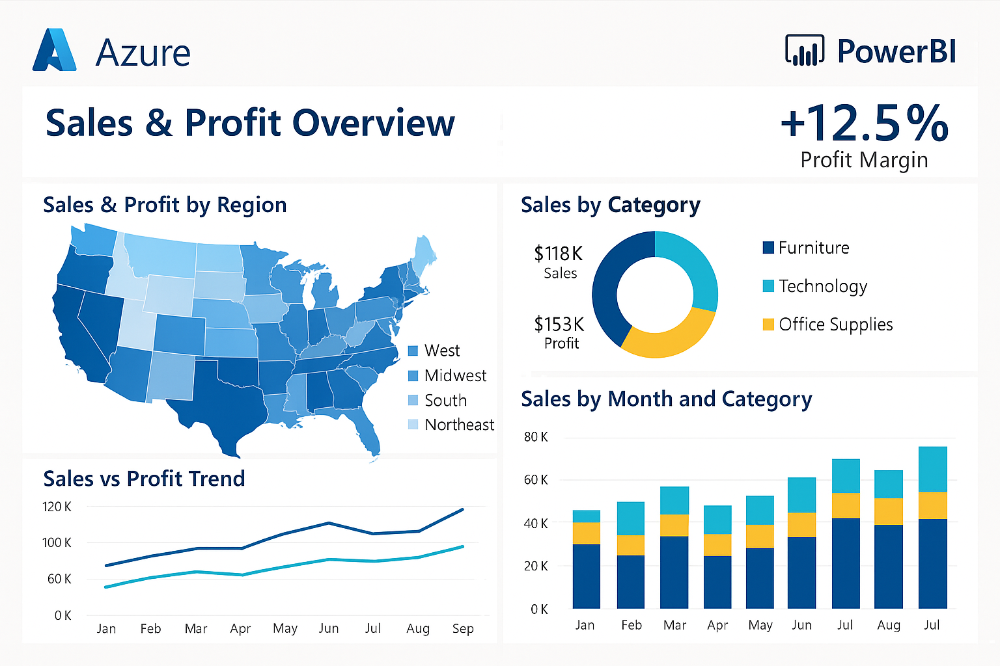

# 📊 BI Automation with SSIS, SSRS, Power BI & Informatica

This project demonstrates a real-world **Business Intelligence automation pipeline** using **SSIS**, **SSRS**, **Power BI**, and **Informatica** — designed to handle high-volume sales data and enable self-service analytics for business teams.

---
## 📈 Power BI Dashboard

This dashboard visualizes revenue trends, discount impacts, and rep performance.


---

## 💼 Use Case

The goal was to automate the daily ingestion, transformation, and visualization of multi-channel sales data across multiple regions and sales reps — reducing manual report preparation from hours to minutes.

---

## 🛠 Tech Stack

| Area               | Tools & Technologies                                |
|--------------------|-----------------------------------------------------|
| ETL & Staging      | SSIS, Informatica                                   |
| Reporting          | Power BI, SSRS                                      |
| Dataset            | CSV + SQL Server                                    |
| Automation         | SQL Server Agent, Audit Logs                        |
| Use Case Themes    | Revenue Trends, Discount Impact, Sales Rep KPIs     |

---

## 📂 Folder Structure

```bash
bi-automation-powerbi-ssis-ssrs/
│
├── datasets/
│   ├── sales_data_5000.csv             # 5,000-row dummy sales dataset
│   └── vw_sales_summary.sql            # View aggregating metrics
│
├── ssis/
│   └── etl_structure.md                # ETL flow with retry logic, audit
│
├── powerbi/
│   ├── dashboard_screenshot_1.png      # Monthly revenue trends
│   ├── dashboard_screenshot_2.png      # Top sales reps
│
└── README.md
```
----
🧪 ETL Flow Highlights (SSIS)
Loads transactional data from CSV (daily)

Calculates revenue with discount logic

Filters invalid records (e.g., quantity = 0)

Logs errors to audit table

Uses checkpoints for safe resume on failure

Scheduled via SQL Server Agent (nightly at 1:00 AM)

More in: ssis/etl_structure.md
----
📈 Power BI Dashboard
This dashboard was built to help regional managers and executives:

Monitor revenue by month, product, and region

Track top-performing sales reps

Analyze discount usage and its impact

Compare channel-wise performance (Online, Retail, Distributor)

🧩 Sample Screenshots:
---
📊 View Summary Logic
vw_sales_summary.sql computes:

Monthly revenue, units sold, and average unit price

Discount rate and margin per product/channel/rep

Used as a base for Power BI dashboards
---

📈 Before / After Metrics

Metric	Before Automation	After Automation
Report Generation Time	3–4 hours	~5 minutes
Manual Errors (per month)	8–12	0
Data Freshness	Weekly	Daily
User Access Type	Static PDF Email	Interactive Dashboard (Power BI Service)

---
📫 Let’s Connect
This project reflects my experience in enterprise BI modernization, including ETL optimization, automated reporting, and scalable dashboard design.

📍 Based in Auckland, NZ — open to remote/hybrid roles in BI, data engineering, or analytics consulting.

🔗 Connect on LinkedIn
